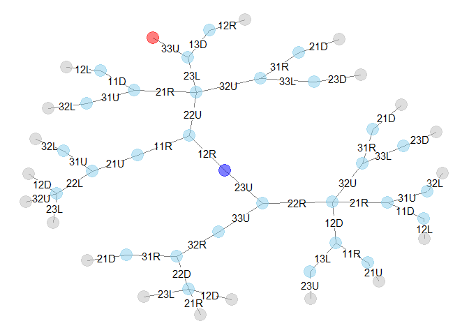

<!-- README.md is generated from README.Rmd. Please edit that file -->

# rSlidePzl

<!-- badges: start -->

<!-- badges: end -->

Analyze sliding puzzle.

## Installation

``` r
# install.packages("devtools")
devtools::install_github("shigono/rSlidePzl")
```

## Example

``` r
library(rSlidePzl)
#> Registered S3 method overwritten by 'GGally':
#>   method from   
#>   +.gg   ggplot2

# make setting of a sliding puzzle
oSetting <- makeSetting(
  boardsize = c(3,3),
  piecesize = list(
    A = c(1, 1),
    B = c(1, 1),
    C = c(1, 1),
    D = c(1, 1),
    E = c(1, 1),
    F = c(1, 1),
    G = c(1, 1),
    H = c(1, 1)
  )
)
# make an initial state
oStart <- makeState(
  list(
    makePiece(type = "A", loc = c(1,1)),
    makePiece(type = "B", loc = c(2,2)),
    makePiece(type = "C", loc = c(1,2)),
    makePiece(type = "D", loc = c(2,1)),
    makePiece(type = "E", loc = c(2,3)),
    makePiece(type = "F", loc = c(3,3)),
    makePiece(type = "G", loc = c(3,1)),
    makePiece(type = "H", loc = c(3,2))
  )
)
stopifnot(isValidState(oStart, oSetting))

# define conditions of goal
oGoalCondition <- makeState(
  list(
    makePiece(type = "A", loc = c(1,1)),
    makePiece(type = "B", loc = c(1,2)),
    makePiece(type = "C", loc = c(1,3)),
    makePiece(type = "D", loc = c(2,1)),
    makePiece(type = "E", loc = c(2,2)),
    makePiece(type = "F", loc = c(2,3)),
    makePiece(type = "G", loc = c(3,1)),
    makePiece(type = "H", loc = c(3,2))
  )
)
stopifnot(isValidState(oGoalCondition, oSetting))

# analyse the puzzle and make a network graph of states
oGraph <- makeGraph(oSetting, oStart, oGoalCondition, max_depth = 5, verbose = 1)
#> Processed # 1 (depth 0 ) of 3 states; goal 0 ; 2 transitions
#> Processed # 2 (depth 1 ) of 5 states; goal 0 ; 4 transitions
#> Processed # 3 (depth 1 ) of 7 states; goal 0 ; 6 transitions
#> Processed # 4 (depth 2 ) of 8 states; goal 0 ; 7 transitions
#> Processed # 5 (depth 2 ) of 11 states; goal 0 ; 10 transitions
#> Processed # 6 (depth 2 ) of 14 states; goal 0 ; 13 transitions
#> Processed # 7 (depth 2 ) of 15 states; goal 0 ; 14 transitions
#> Processed # 8 (depth 3 ) of 17 states; goal 0 ; 16 transitions
#> Processed # 9 (depth 3 ) of 19 states; goal 0 ; 18 transitions
#> Processed # 10 (depth 3 ) of 21 states; goal 1 ; 20 transitions
#> Processed # 11 (depth 3 ) of 23 states; goal 1 ; 22 transitions
#> Processed # 12 (depth 3 ) of 25 states; goal 1 ; 24 transitions
#> Processed # 13 (depth 3 ) of 27 states; goal 1 ; 26 transitions
#> Processed # 14 (depth 3 ) of 29 states; goal 1 ; 28 transitions
#> Processed # 15 (depth 3 ) of 31 states; goal 1 ; 30 transitions
#> Processed # 16 (depth 4 ) of 34 states; goal 1 ; 33 transitions
#> Processed # 17 (depth 4 ) of 35 states; goal 1 ; 34 transitions
#> Processed # 18 (depth 4 ) of 36 states; goal 1 ; 35 transitions
#> Processed # 19 (depth 4 ) of 37 states; goal 1 ; 36 transitions
#> Processed # 20 (depth 4 ) of 38 states; goal 1 ; 37 transitions
#> Processed # 22 (depth 4 ) of 39 states; goal 1 ; 38 transitions
#> Processed # 23 (depth 4 ) of 40 states; goal 1 ; 39 transitions
#> Processed # 24 (depth 4 ) of 41 states; goal 1 ; 40 transitions
#> Processed # 25 (depth 4 ) of 42 states; goal 1 ; 41 transitions
#> Processed # 26 (depth 4 ) of 43 states; goal 1 ; 42 transitions
#> Processed # 27 (depth 4 ) of 44 states; goal 1 ; 43 transitions
#> Processed # 28 (depth 4 ) of 45 states; goal 1 ; 44 transitions
#> Processed # 29 (depth 4 ) of 46 states; goal 1 ; 45 transitions
#> Processed # 30 (depth 4 ) of 49 states; goal 1 ; 48 transitions
#> Processed # 31 (depth 4 ) of 50 states; goal 1 ; 49 transitions
# 
# # plot
plotGraph(oGraph, method = "GGally")
#> Loading required package: ggplot2
```



``` r
 
# # show shortest pathes
lSolution <- getShortestPaths(oGraph)
print(lSolution$state)
#> [[1]]
#> [1] "11A12C21D22B23E31G32H33F" "11A13C21D22B23E31G32H33F"
#> [3] "11A12B13C21D23E31G32H33F" "11A12B13C21D22E31G32H33F"
#> [5] "11A12B13C21D22E23F31G32H"
print(lSolution$transition)
#> [[1]]
#> [1] "12R" "22U" "23L" "33U"
```
