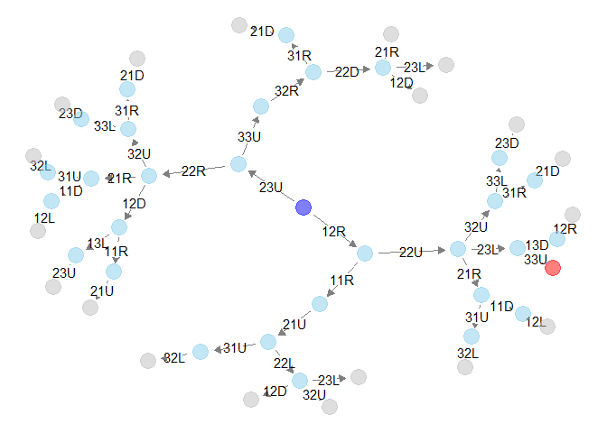

<!-- README.md is generated from README.Rmd. Please edit that file -->

# rSlidePzl

<!-- badges: start -->

<!-- badges: end -->

`rSlidePzl` package provides funtions to analyze [sliding
puzzle](https://en.wikipedia.org/wiki/Sliding_puzzle).

With `rSlidePzl::makeGraph` function, you can make a network graph
representing possible ‘states’ (snapshots of board) and transition
relationships between states.

You can examine the property of the graph with `igraph` package, or any
other software for network analysis (e.g. [Gephi](https://gephi.org/)).

## Installation

``` r
# install.packages("devtools")
devtools::install_github("shigono/rSlidePzl")
```

## Example

Suppose you have a simple sliding puzzle with 8 pieces. The size of
board is 3 x 3. The size of each pieces is 1 x 1.

The initial state is:

|      | col1 | col2 | col3 |
| ---- | :--- | :--- | :--- |
| row1 | A    | C    |      |
| row2 | D    | B    | E    |
| row3 | F    | G    | F    |

Your goal is:

|      | col1 | col2 | col3 |
| ---- | :--- | :--- | :--- |
| row1 | A    | B    | C    |
| row2 | D    | E    | F    |
| row3 | G    | H    |      |

Let’s try to analyse this puzzle with `rSlidePzl` package.

### make a network graph

``` r
library(rSlidePzl)
#> Registered S3 method overwritten by 'GGally':
#>   method from   
#>   +.gg   ggplot2

# make setting of a sliding puzzle
oSetting <- makeSetting(
  boardsize = c(3,3),
  piecesize = list(
    A = c(1, 1),
    B = c(1, 1),
    C = c(1, 1),
    D = c(1, 1),
    E = c(1, 1),
    F = c(1, 1),
    G = c(1, 1),
    H = c(1, 1)
  )
)
# make an initial state
oStart <- makeState(
  list(
    makePiece(type = "A", loc = c(1,1)),
    makePiece(type = "B", loc = c(2,2)),
    makePiece(type = "C", loc = c(1,2)),
    makePiece(type = "D", loc = c(2,1)),
    makePiece(type = "E", loc = c(2,3)),
    makePiece(type = "F", loc = c(3,3)),
    makePiece(type = "G", loc = c(3,1)),
    makePiece(type = "H", loc = c(3,2))
  )
)
stopifnot(isValidState(oStart, oSetting))

# define conditions of goal
oGoalCondition <- makeState(
  list(
    makePiece(type = "A", loc = c(1,1)),
    makePiece(type = "B", loc = c(1,2)),
    makePiece(type = "C", loc = c(1,3)),
    makePiece(type = "D", loc = c(2,1)),
    makePiece(type = "E", loc = c(2,2)),
    makePiece(type = "F", loc = c(2,3)),
    makePiece(type = "G", loc = c(3,1)),
    makePiece(type = "H", loc = c(3,2))
  )
)
stopifnot(isValidState(oGoalCondition, oSetting))

# find all states within 5 moves and make a network graph of them
oGraph <- makeGraph(oSetting, oStart, oGoalCondition, max_depth = 5, verbose = 0)
plotGraph(oGraph, method = "GGally")
```



The blue node (circle) in the plot represents the initial states. Other
nodes are possible states you can generate by moving pieces within 5
times.

The edges between nodes represent transition relationships between node.
For example, at inital state you have two choice: move a piece at (1,2)
(piece C) right, or move a piece at (2,3) (piece E) upper.

Notes that makeGraph() function can take VERY LONG time. I recommend to
limit the search space by `max_depth` argument or `max_num_states`
argument.

It would be better to avoid to plot a large graph in R. Consider to use
Gephi or some other software instead.

### find best solutions

The main purpose of `rSlidePzl` package is to make a network graph of
possible states in given puzzle, not to get solutions of the puzzle. But
in this case you have reached to the goal state (the red node in graph),
so you can see a best solution.

Your best moves are:

``` r
# # show shortest pathes
lSolution <- getShortestPaths(oGraph)
print(lSolution$transition)
#> [[1]]
#> [1] "12R" "22U" "23L" "33U"
```

It says: move a piece at (1,2) right,

|      | col1 | col2 | col3 |
| ---- | :--- | :--- | :--- |
| row1 | A    |      | C    |
| row2 | D    | B    | E    |
| row3 | G    | H    | F    |

move a piece at (2,2) upper,

|      | col1 | col2 | col3 |
| ---- | :--- | :--- | :--- |
| row1 | A    | B    | C    |
| row2 | D    |      | E    |
| row3 | G    | H    | F    |

move a piece at (2,3) left,

|      | col1 | col2 | col3 |
| ---- | :--- | :--- | :--- |
| row1 | A    | B    | C    |
| row2 | D    | E    |      |
| row3 | G    | H    | F    |

and move a piece at (3,3) upper.

|      | col1 | col2 | col3 |
| ---- | :--- | :--- | :--- |
| row1 | A    | B    | C    |
| row2 | D    | E    | F    |
| row3 | G    | H    |      |

Enjoy.
